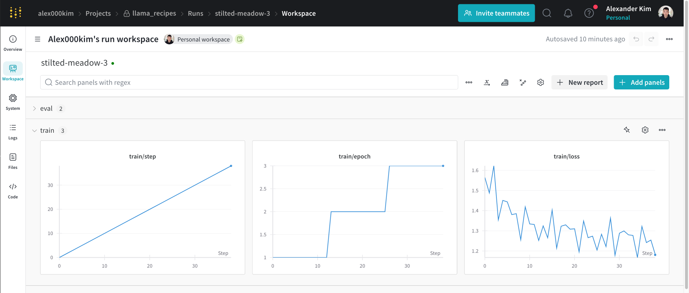
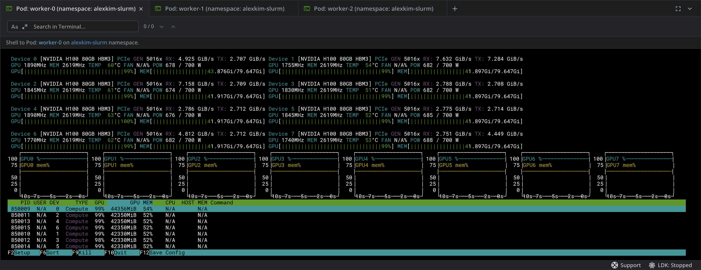
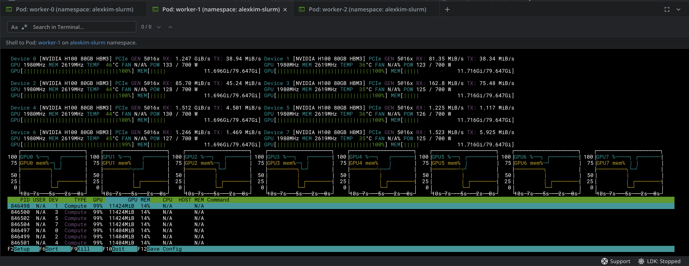
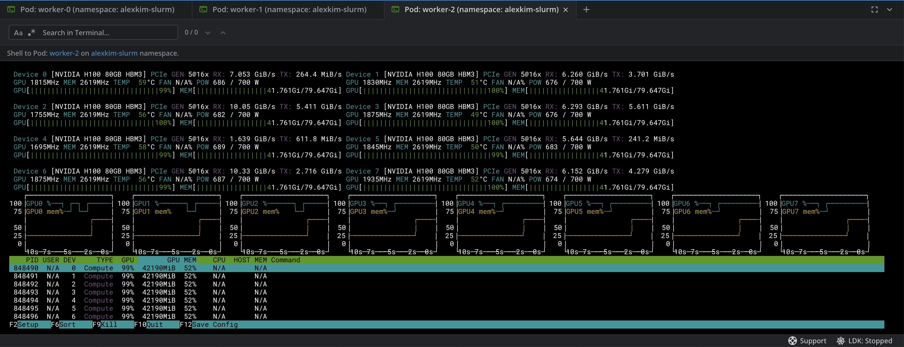

# Multi-node LLM finetuning on SLURM


## Installation

To get started, clone the repository and install the required dependencies:

```bash
git clone https://github.com/alex000kim/multi-mode-llm-finetuning-slurm.git
cd multi-mode-llm-finetuning-slurm
python -m venv .venv
source .venv/bin/activate
pip install -r requirements.txt
```

## Environment Variables

Before running any scripts, ensure you have set up the necessary environment variables:

```bash
export HF_TOKEN=your_huggingface_token
export WANDB_API_KEY=your_wandb_api_key # optional
```

## Downloading the Model

To download the Meta Llama 3 model, run:

```bash
python download_model.py
```

## Downloading the Dataset

Download the sample dataset using:

```bash
wget -P src/llama_recipes/datasets https://raw.githubusercontent.com/tatsu-lab/stanford_alpaca/main/alpaca_data.json
```

## Fine-tuning

To fine-tune the model, use the provided SLURM scripts. Make sure to adjust the SLURM configurations according to your cluster setup (e.g. number of nodes, GPUs per node, etc.)

```bash
chmod +x srun.sh # only needed once
sbatch sbatch.sh
```

Note that `sbatch.sh` contains `#SBATCH --export=ALL` which exports all environment variables to the job including `HF_TOKEN` and `WANDB_API_KEY` exported above.

## Check logs


- To check stdout logs, run:
```
tail -f O-llama-finetune_<N>.txt
```

- To check stderr logs, run:
```
tail -f E-llama-finetune_<N>.txt
```

where `<N>` is the job number.
The format of the log files is defined in `sbatch.sh`.

## Monitoring

- To monitor the training process, we can open open a WandB dashboard



- To monitor GPU utilization in real-time, we can open a bash shell in any worker node:

```
kubectl exec -it worker-1 -n alexkim-slurm -- /bin/bash
```
then install `nvtop`:

```bash
apt install nvtop
```

Then, you can monitor the GPU utilization by running `nvtop`.

- worker-1

- worker-2

- worker-3

